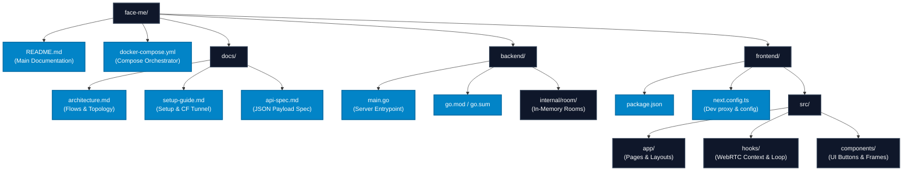
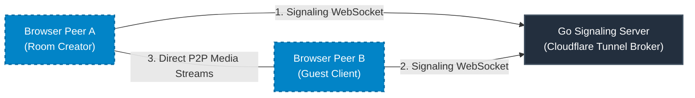

# FaceMe: Peer-to-Peer FaceTime Clone

FaceMe is a robust, ultra-low-resource, strict 1-to-1 peer-to-peer video calling application.

It is designed to showcase modern web technologies, including **WebRTC** for direct browser-to-browser media streaming, **Next.js** for a fluid and premium front-end experience, and **Go** for a high-concurrency, zero-persistence signaling backend.

---

## 🚀 Live Deployments

* **Frontend App:** [faceme.switchspace.in](https://faceme.switchspace.in)
* **Backend Signaling API:** `faceme-api.switchspace.in` (Secured behind a Cloudflare Tunnel with no public ports exposed on the host machine)

---

## 🛠️ Technology Stack

| Layer | Technology | Description |
| :--- | :--- | :--- |
| **Frontend** | **Next.js 16** & **React 19** | App Router framework written in **TypeScript**. |
| **Styling** | **Tailwind CSS v4** | Modern, premium utilities with fluid hover micro-animations. |
| **Backend** | **Go (Golang)** | Signaling server using `gorilla/websocket` with in-memory synchronization. |
| **Media Stream** | **WebRTC** | Native browser APIs utilizing Google's public STUN servers. |
| **Deployment** | **Vercel** & **Cloudflare Tunnels** | Frontend hosted on Vercel Edge; Go backend hosted on a private server via `cloudflared`. |

---

## 📦 Directory Structure

---

## 🧩 High-Level System Architecture

FaceMe streams media directly between browser peers. The backend server acts only as a signaling broker to coordinate connection descriptors (SDP) and connection paths (ICE).

Once the signaling handshake completes, the audio/video bytes flow directly between browser clients, ensuring complete media privacy and saving server bandwidth.

---

## 📚 Detailed Documentation

Explore the sub-documentation files to learn more about the internals of FaceMe:

1. **[System Design & Architecture](./docs/architecture.md):** Detailed explanations of the WebRTC sequence flow, state machines, and the Cloudflare Tunnel deployment topology.
2. **[Developer Setup & Deployment Guide](./docs/setup-guide.md):** Prerequisites, local execution commands, Docker setups, Secure Context requirements, and private server installation via `cloudflared`.
3. **[API & Signaling Specifications](./docs/api-spec.md):** JSON payload structures for WebSocket communication, room creation endpoints, and connection logic.

---

## 📜 License

This project is licensed under the [MIT License](LICENSE).
