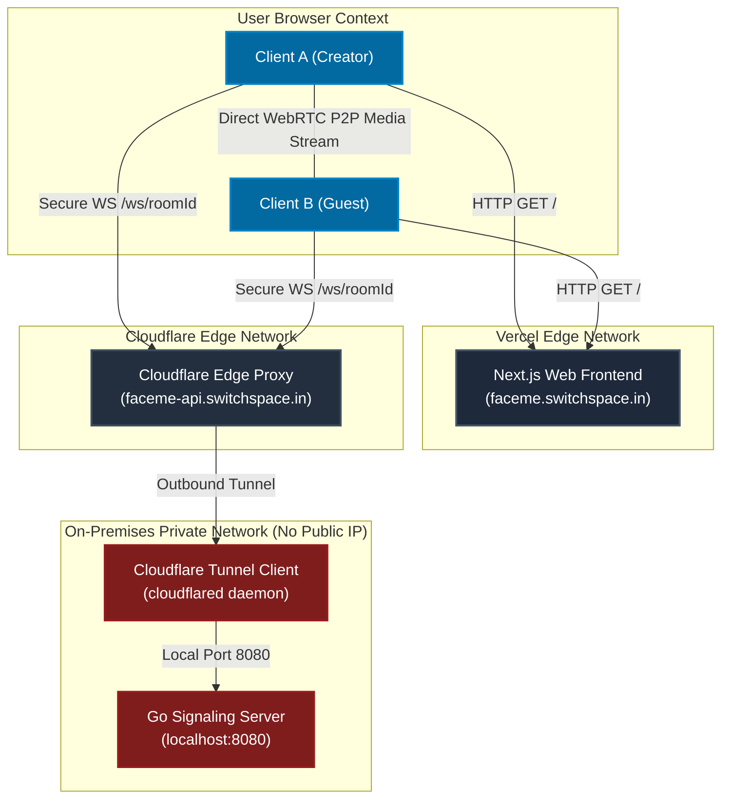
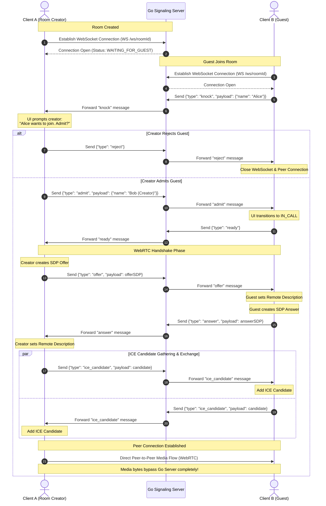
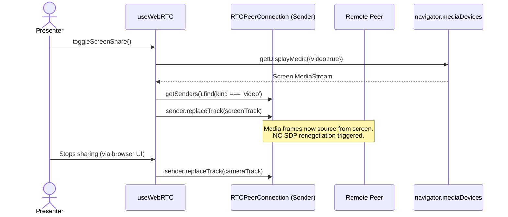
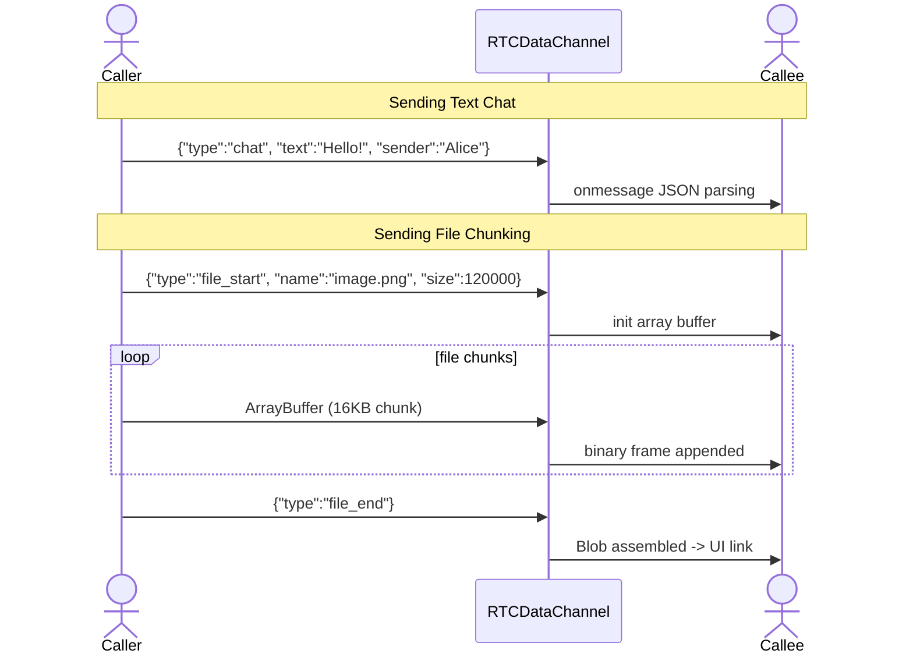
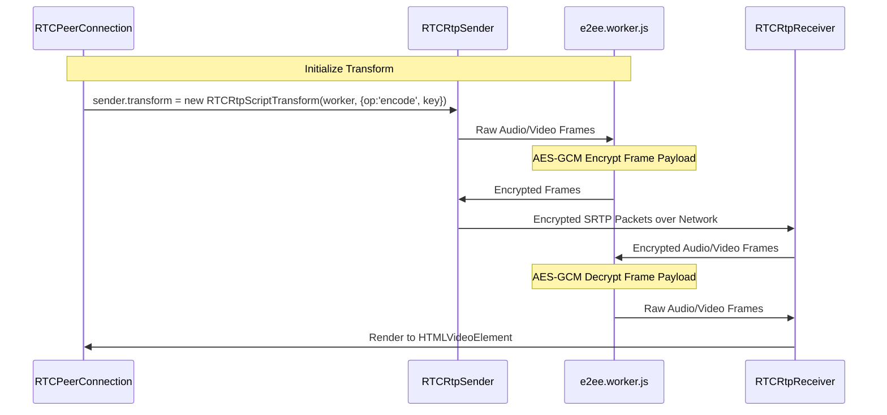

# System Architecture & Design

This document details the system design, communication protocols, WebRTC handshake flow, and deployment topology of **FaceMe**.

---

## 1. Deployment Topology

The application is deployed using a hybrid serverless/on-premises architecture designed to optimize privacy, security, and cost.

* **Frontend:** Built with Next.js and hosted on the Vercel Edge Network for rapid static asset delivery and serverless route optimization.
* **Backend:** A lightweight Go application running on a private server inside a local network with **no public IP address**.
* **Tunneling & Security:** A Cloudflare Tunnel client daemon (`cloudflared`) runs next to the Go backend on the private server. It initiates a persistent outbound control link to the Cloudflare Edge network. All user requests to `faceme-api.switchspace.in` are securely proxied through Cloudflare down to the local server, completely eliminating the need to expose ports on a home router.

### Deployment Architecture Diagram



---

## 2. WebRTC Signaling Sequence

WebRTC requires an out-of-band communication channel (signaling) to exchange session configurations and network routing options. The Go backend handles this coordination by acting as an in-memory pub/sub broker.

The signaling handshake, knock system, and direct media establishment flow:



---

## 3. Go Backend State Management

The backend is built in Go to guarantee low-latency, concurrent operations, and small memory foot-prints.

### In-Memory Thread Safety

Because there is no persistent database, all state is ephemeral and resides in RAM. The system uses native Go concurrency primitives to remain thread-safe:

* **`sync.Map` (`Rooms`):** Stores active rooms. This provides a lock-free read implementation for high-concurrency access to room pointers.
* **`sync.Mutex` (`Room.mu`):** Each individual room manages a mutex lock `mu` to prevent data races on its `Clients` map during join, leave, and broadcasting operations.

```go
type Client struct {
 Conn *websocket.Conn
 Send chan []byte
}

type Room struct {
 ID      string
 Topic   string
 Clients map[*Client]bool
 mu      sync.Mutex
}
```

### Lifecycle Rules & Guards

1. **Strict 2-Person Limit:** The room joining method inspects the `Clients` map. If `len(r.Clients) >= 2`, the client is immediately rejected with a `{ "error": "Room is full" }` message, and the WebSocket is closed.
2. **Zero-Waste Purge:** When a client leaves, they are removed from their room's `Clients` map. If `len(r.Clients) == 0`, the room ID is deleted from the global `Rooms` `sync.Map` immediately, ensuring zero leakage of stale memory allocations.

---

## 4. Frontend State Machine (Next.js)

The React client controls page interactions using a WebRTC hook. The connection cycle implements the following states:

* **`IDLE`**: Initial state where the user enters their username and enters/creates a room code.
* **`WAITING_FOR_GUEST`**: (Creator only) Active after joining the room, waiting for another client to connect.
* **`KNOCKING`**: (Guest only) Sent a `knock` request to join the room and waiting for the creator's decision.
* **`PROMPTING_CREATOR`**: (Creator only) Displays a modal interface asking to "Admit" or "Reject" the knocking guest.
* **`IN_CALL`**: The signaling handshake completed and WebRTC P2P stream is active.
* **`REJECTED`**: (Guest only) The creator declined the knock request; local media tracks are stopped and cleanup is run.

---

## 5. Level 2 Features

### Screen Share Track Replacement (Zero-Renegotiation)



### P2P DataChannel Payload Structure

Data flow completely bypasses the Go backend.



### WebRTC Encoded Transform (E2EE)


