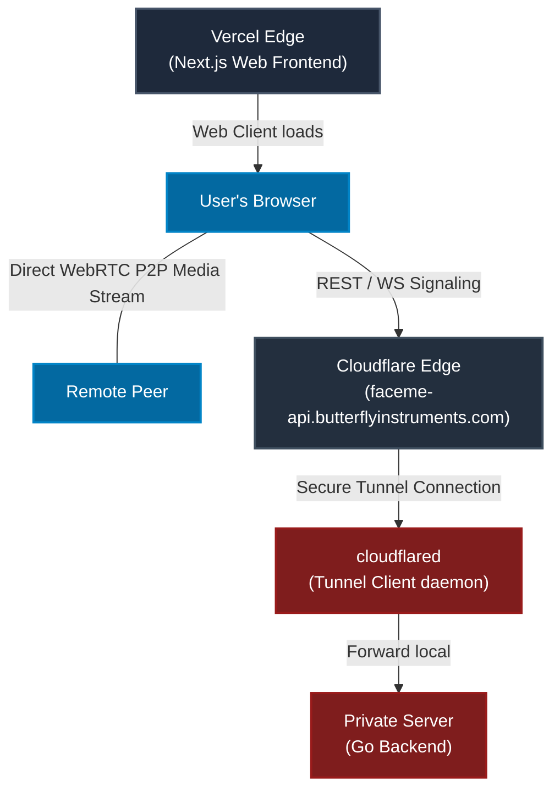

# Developer Setup & Deployment Guide

This guide describes how to run **FaceMe** locally, configure secure HTTPS testing for physical mobile devices, and deploy the application in production.

---

## 1. Prerequisites

Before getting started, make sure you have the following installed on your system:

- **Go** (version 1.21 or higher)
- **Node.js** (version 18 or higher) and `npm`
- **Docker** and **Docker Compose** (optional, for containerized execution)
- **cloudflared** (optional, for tunneling and production deployment)

---

## 2. Local Development Setup

To run both services side-by-side locally, open two terminal sessions:

### 2.1 Backend Signaling Server (Go)

1. Navigate to the backend directory:

   ```bash
   cd backend
   ```

2. Build and run the server (defaults to port `8080`):

   ```bash
   go run main.go
   ```

   *The console should print: `Signaling server started on :8080`*

### 2.2 Frontend Client (Next.js)

1. Navigate to the frontend directory:

   ```bash
   cd frontend
   ```

2. Install npm dependencies:

   ```bash
   npm install
   ```

3. Start the Next.js development server:

   ```bash
   npm run dev
   ```

4. Open [http://localhost:3000](http://localhost:3000) in your browser.

> [!NOTE]
> **Dev Proxy Configuration:** The Next.js dev server has a custom rewrite configuration in [next.config.ts](file:///Users/deva/webapps/portfolio/face-me/frontend/next.config.ts) that forwards all requests to `/api/*` and `/ws/*` automatically to the local Go server at `http://localhost:8080`.

### 2.3 Running with Docker Compose

If you prefer running everything in a containerized environment:

1. From the project root, run:

   ```bash
   docker compose up --build
   ```

2. This spins up the backend Go container exposing port `8080`.

---

## 3. WebRTC Secure Context Requirements (HTTPS)

WebRTC APIs (like `getUserMedia` for accessing the camera and microphone) are restricted by modern browsers. They will **only** load in a **Secure Context**:

- `http://localhost` (or `http://127.0.0.1`)
- Any origin served over `https://`

### Local Testing on Mobile Devices

To test the video call on a physical phone and laptop together in local development, serving over `http://192.168.x.x` will **not** work because the phone will block camera access. You must expose your local development environment over a temporary HTTPS URL.

We recommend using one of the following tunneling tools:

#### Option A: Cloudflare Tunnels (Quick tunnel)

```bash
cloudflared tunnel --url http://localhost:3000
```

This will output a random `.trycloudflare.com` HTTPS URL which you can load on your phone.

#### Option B: Pinggy (SSH Tunneling - No install needed)

```bash
ssh -R 80:localhost:3000 public@ssh.pinggy.io
```

---

## 4. Production Deployment

The production release is designed to be highly secure and cost-efficient:

- **Frontend:** Deployed to **Vercel** (`faceme.butterflyinstruments.com`).
- **Backend:** Deployed on a **Private Home Server** with no public IP address, exposed securely to the internet via a **Cloudflare Tunnel** (`faceme-api.butterflyinstruments.com`).



### 4.1 Deploying the Backend via Cloudflare Tunnel

Since the private server has no public IP, it cannot accept incoming direct connections. Instead, the `cloudflared` daemon runs on the server and maintains an active *outbound* connection to Cloudflare's nearest edge servers. Cloudflare routes incoming requests to `faceme-api.butterflyinstruments.com` through this tunnel.

#### Step 1: Install cloudflared on your private server

Refer to the official Cloudflare downloads page for your server OS (e.g. Linux/macOS).

#### Step 2: Authenticate cloudflared

On the private server, run:

```bash
cloudflared tunnel login
```

Follow the URL to authorize your Cloudflare account and select the domain `butterflyinstruments.com`.

#### Step 3: Create a Tunnel

```bash
cloudflared tunnel create faceme-tunnel
```

This generates a tunnel credentials JSON file (e.g., `~/.cloudflared/xxxxxx.json`).

#### Step 4: Route your Subdomain to the Tunnel

Associate the subdomain `faceme-api.butterflyinstruments.com` with your tunnel:

```bash
cloudflared tunnel route dns faceme-tunnel faceme-api.butterflyinstruments.com
```

#### Step 5: Configure the Tunnel

Create a configuration file at `~/.cloudflared/config.yml`:

```yaml
tunnel: faceme-tunnel
credentials-file: /home/user/.cloudflared/xxxxxx.json

ingress:
  - hostname: faceme-api.butterflyinstruments.com
    service: http://localhost:8080
  - service: http_status:404
```

#### Step 6: Start the Go Backend & Run the Tunnel

1. Start your Go backend in Docker or natively on port `8080`.
2. Run the tunnel daemon:

   ```bash
   cloudflared tunnel run faceme-tunnel
   ```

   *(To run as a system service, use `cloudflared service install` so it boots on system start).*

---

### 4.2 Deploying the Frontend (Vercel)

1. Create a new project on **Vercel** and connect it to your Git repository.
2. In the Next.js frontend code, configure the environment variables so that production API calls target `faceme-api.butterflyinstruments.com` instead of localhost:
   - **`NEXT_PUBLIC_API_URL`**: `https://faceme-api.butterflyinstruments.com`
   - **`NEXT_PUBLIC_WS_URL`**: `wss://faceme-api.butterflyinstruments.com`
3. Configure your custom domain `faceme.butterflyinstruments.com` in Vercel settings and add the CNAME records to your DNS provider (Cloudflare).
